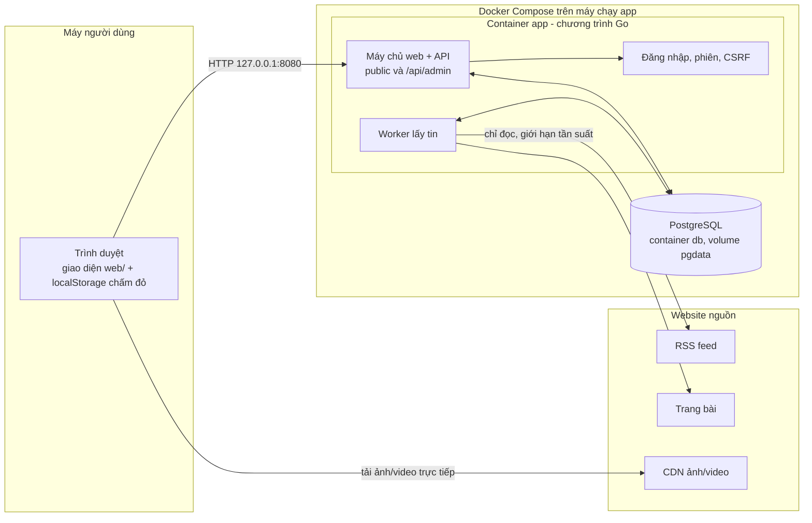
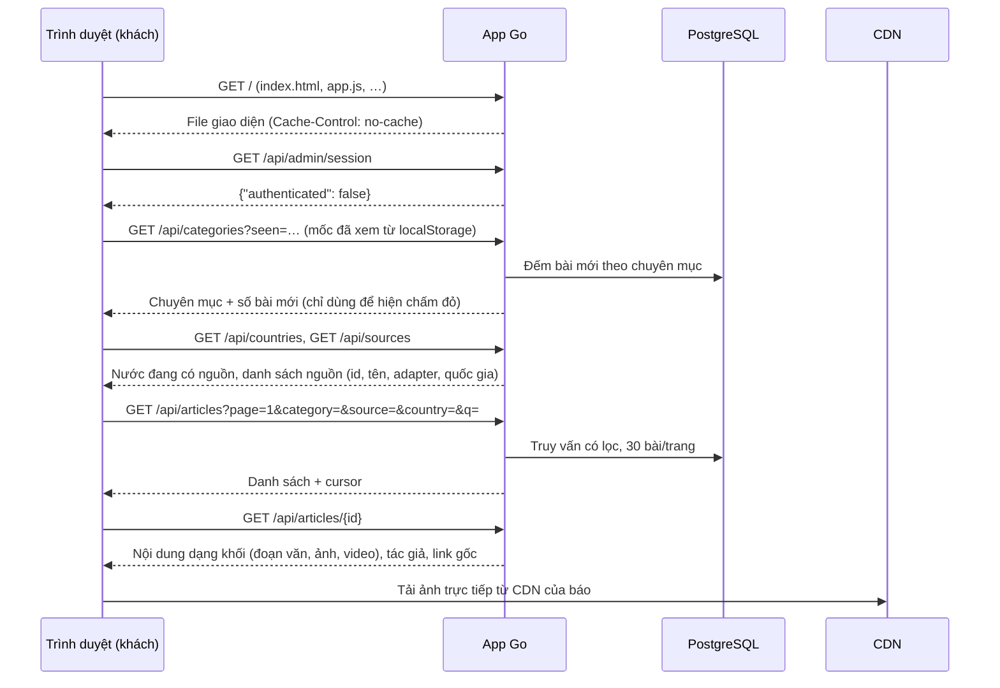
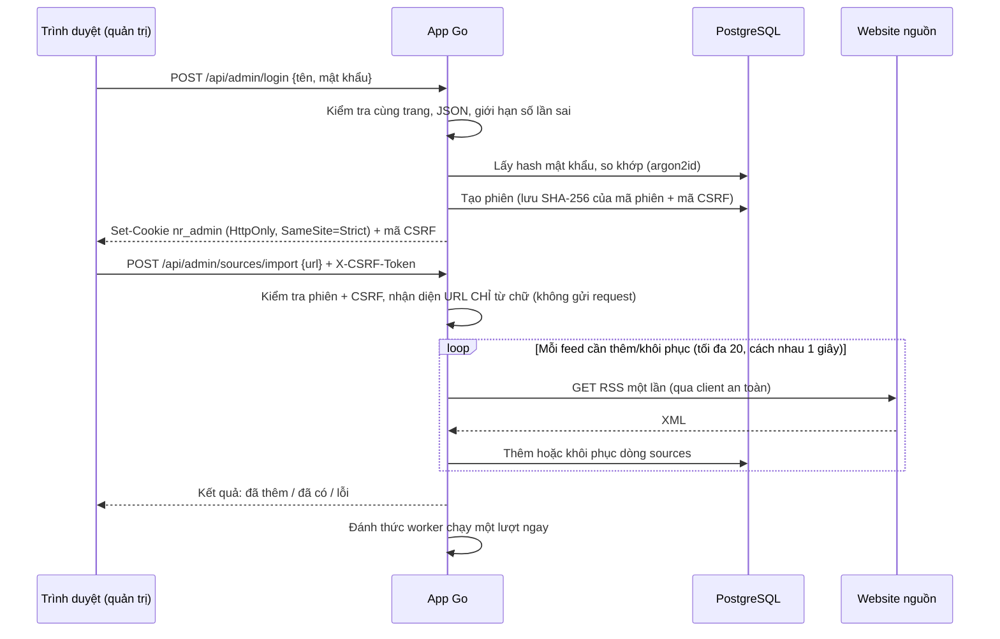
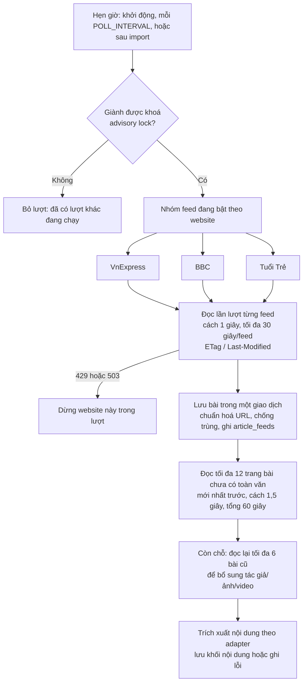
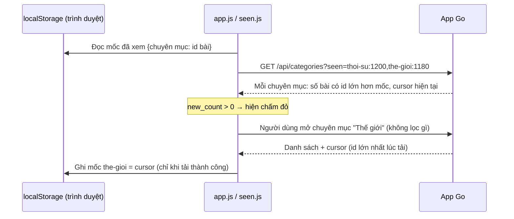
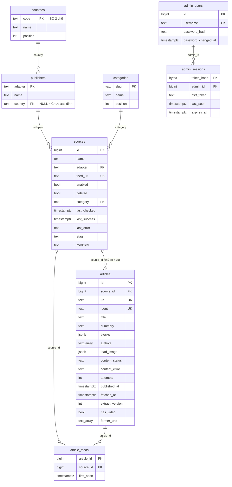

# Giải thích hệ thống và kỹ thuật — News Reader

Tài liệu giúp người mua hiểu hệ thống từ đầu đến cuối và tự trình bày thiết kế, giới hạn bằng lời của mình. Mọi con số và tên trong tài liệu lấy từ **mã nguồn hiện tại**; chỗ nào lấy từ báo cáo cũ đều ghi ngày.

Đọc kèm: [HUONG-DAN-VAN-HANH-VA-XU-LY-LOI.md](HUONG-DAN-VAN-HANH-VA-XU-LY-LOI.md) (vận hành, xử lý lỗi, sao lưu).

---

## A. Tổng quan dễ hiểu

### A.1. Website giải quyết vấn đề gì

News Reader là **trình đọc tin tổng hợp**: thay vì mở từng báo, người đọc xem tin từ nhiều báo trong **một giao diện**, lọc theo chuyên mục, quốc gia của tờ báo, nguồn, và tìm theo tiêu đề. Mỗi bài luôn ghi rõ nguồn và có liên kết về bài gốc.

| Ai | Làm gì | Cần đăng nhập? |
|---|---|---|
| **Người đọc (khách)** | Xem danh sách, đọc bài, tìm kiếm, lọc | Không |
| **Quản trị viên (một người)** | Thêm/import nguồn, đổi tên, đổi chuyên mục, chọn quốc gia của website, bật/tắt, xoá nguồn, xem trạng thái lấy tin | Có (tên + mật khẩu) |
| **Hệ thống (worker)** | Tự đi lấy tin định kỳ | — |

### A.2. Các thành phần và vai trò

| Thành phần | Nói đơn giản | Trong project |
|---|---|---|
| **Frontend** (giao diện) | Phần hiển thị trong trình duyệt | HTML/CSS/JavaScript thuần trong thư mục `web/`, không dùng framework, không cần Node.js để chạy |
| **Backend Go** | Chương trình trên máy chủ: trả dữ liệu cho giao diện, kiểm tra quyền, lưu dữ liệu | `cmd/server/` (máy chủ web, API, worker, đăng nhập) và `internal/news/` (đọc RSS, trích xuất nội dung từng báo) |
| **PostgreSQL** | Cơ sở dữ liệu: nơi lưu mọi thứ lâu dài | Container `db`, dữ liệu trong volume `pgdata` |
| **Worker** | "Nhân viên chạy nền" tự đi lấy tin | Nằm **trong cùng chương trình Go** với máy chủ web (không phải dịch vụ riêng) |
| **Docker / Docker Compose** | Đóng gói và chạy các thành phần | `Dockerfile` (đóng gói app), `compose.yaml` (chạy app + db) |

### A.3. Website nguồn, publisher, feed RSS, bài viết, chuyên mục

| Khái niệm | Nghĩa | Ví dụ |
|---|---|---|
| **Website nguồn / publisher** (tòa soạn) | Tờ báo. Trong code mỗi website ứng với một **adapter** và một dòng trong bảng `publishers` | VnExpress (`vnexpress`), BBC News (`bbc`), Tuổi Trẻ Online (`tuoitre`) |
| **Adapter** | Bộ quy tắc riêng để đọc đúng một website (URL nào hợp lệ, nội dung bài nằm ở đâu trên trang) | `internal/news/feed.go`, `content.go`, `tuoitre.go`, `video.go` |
| **Feed RSS** (trong giao diện gọi là "nguồn") | Một địa chỉ báo cung cấp danh sách bài mới dạng máy đọc được. Một website có nhiều feed | `https://vnexpress.net/rss/thoi-su.rss` |
| **Bài viết** | Một tin, lưu **một lần** dù xuất hiện ở nhiều feed | — |
| **Chuyên mục** | Nhóm hiển thị: Thời sự, Thế giới, Kinh doanh, Công nghệ, Giải trí, Thể thao, Sức khỏe, Đời sống, Khác. Mỗi **feed** được gán một chuyên mục; bài thuộc chuyên mục của **mọi feed đã liệt kê nó**. Không đoán từ tiêu đề | Feed "BBC World" → Thế giới |

### A.4. Quốc gia: của tờ báo, không phải của nội dung, không phải ngôn ngữ

- Quốc gia gán cho **website** (bảng `publishers`, cột `country`), nên **mọi feed** của một website luôn cùng quốc gia.
- Hiện tại: VnExpress, Tuổi Trẻ Online → **Việt Nam**; BBC News → **Vương quốc Anh**.
- Bài BBC viết về Việt Nam vẫn thuộc **Vương quốc Anh**. Hệ thống **không** đọc nội dung để đoán quốc gia, **không** dùng AI, **không** suy từ tên miền.
- Quốc gia ≠ ngôn ngữ: BBC tiếng Anh thuộc Vương quốc Anh; một tờ báo tiếng Anh của Việt Nam (nếu sau này có adapter) vẫn là Việt Nam. Hệ thống **không dịch** bài.
- Website chưa gán hiển thị **"Chưa xác định"**.
- Danh sách chọn có 66 nước (gồm Thái Lan, Trung Quốc), nhưng **chưa có nguồn** của các nước ngoài Việt Nam và Anh.

### A.5. Nguồn đang hỗ trợ

Chỉ **3 website**: VnExpress, BBC News (phần `/news/`), Tuổi Trẻ Online. Danh mục feed đã kiểm tra (`news.Catalog` trong `internal/news/importer.go`) có **19 feed**: 9 VnExpress, 6 BBC, 4 Tuổi Trẻ (gồm feed Video).

**Dán một URL không có nghĩa là hệ thống tự hỗ trợ website đó.** Mỗi website có cấu trúc trang khác nhau; muốn thêm website mới phải viết adapter (mục G.5). URL của website khác bị từ chối với thông báo "Nguồn này chưa được hỗ trợ".

---

## B. Kiến trúc và luồng hoàn chỉnh

### B.1. Sơ đồ kiến trúc

Điểm chính:
- Trình duyệt chỉ nói chuyện với app (dữ liệu) và với CDN của báo (ảnh/video).
- App **không** làm trung gian ảnh/video: không tải, không lưu, không chuyển tiếp.
- Database không mở cổng ra ngoài; chỉ container app kết nối được.

### B.2. Luồng: khách mở trang, lọc, tìm và đọc bài

Tất cả là thao tác **đồng bộ** (trả lời ngay khi người dùng bấm). Không bước nào gửi request ra website nguồn, trừ việc trình duyệt tải ảnh/video.

### B.3. Luồng: quản trị đăng nhập và import nguồn

### B.4. Luồng: worker lấy tin (chạy nền)

Ba website chạy **song song**; trong một website mọi request đi **lần lượt** có khoảng nghỉ.

### B.5. Ảnh và video đi thẳng từ nguồn

Database lưu **địa chỉ** ảnh/video, không lưu file. Khi mở bài, trình duyệt tải ảnh từ `ichef.bbci.co.uk`, `*.vnecdn.net`, `cdn2.tuoitre.vn` (video MP4 chỉ từ `cdn2.tuoitre.vn`). Chính sách bảo mật nội dung (CSP) của trang chỉ cho phép đúng các máy chủ này.

### B.6. Đánh dấu đã xem và chấm đỏ

- **Mốc** là **id bài** (cấp theo thứ tự hệ thống nhận bài), không phải giờ đăng. Bài đến muộn (giờ đăng cũ) vẫn được tính là mới.
- Chỉ đánh dấu khi **người dùng** mở chuyên mục, tải **thành công**, và **không** lọc theo nguồn, quốc gia hay từ khoá. Tự làm mới mỗi 2 phút, màn hình "Tất cả" và request lỗi không đánh dấu.
- Lưu ở trình duyệt nên mỗi trình duyệt/thiết bị có trạng thái riêng.
- Máy chủ cấp id bài trong một giao dịch giữ khoá, nên id hiển thị theo thứ tự tăng dần và mốc không bao giờ bỏ sót bài.

### B.7. Theo một bài mẫu từ RSS đến giao diện

Ví dụ minh hoạ (giả định, không phải dữ liệu thật): feed `https://vnexpress.net/rss/the-gioi.rss` có mục với link `https://vnexpress.net/bau-cu-o-nuoc-x-5000001.html?utm_source=rss`.

| Bước | Ở đâu | Đồng bộ/nền | Kết quả | Lưu ở |
|---|---|---|---|---|
| 1 | Worker đọc feed (có ETag; nếu feed không đổi, nguồn trả 304 và dừng ở đây) | Nền | XML danh sách bài | — |
| 2 | Kiểm tra link thuộc `vnexpress.net`, `https` | Nền | Hợp lệ | — |
| 3 | Chuẩn hoá URL: bỏ `utm_source` | Nền | `https://vnexpress.net/bau-cu-o-nuoc-x-5000001.html` | — |
| 4 | Tính định danh ổn định từ mã bài | Nền | `vnexpress:5000001` | `articles.ident` |
| 5 | Thêm bài nếu chưa có (URL và ident là duy nhất); nếu đã có thì chỉ ghi nhận thêm feed | Nền, trong giao dịch | Bài mới id N, trạng thái `summary` (tóm tắt RSS, ảnh RSS) | `articles`, `article_feeds` |
| 6 | Bài xuất hiện trong danh sách với nhãn "Tóm tắt · đang chờ lấy nội dung", thuộc chuyên mục Thế giới (theo feed) | Đồng bộ khi người dùng tải trang | — | — |
| 7 | Cuối lượt, worker đọc trang bài (nếu nằm trong 12 bài ưu tiên) | Nền | HTML trang bài | — |
| 8 | Adapter VnExpress tìm vùng `fck_detail`, lấy đoạn văn, ảnh, chú thích, dòng ký tên tác giả | Nền | Khối nội dung | `articles.blocks`, `authors`, `lead_image` |
| 9 | Đủ chữ → `full`; không đủ/lỗi → giữ tóm tắt, ghi lỗi, hẹn thử lại | Nền | Nhãn "Toàn văn" hoặc "Chỉ có tóm tắt" | `content_status`, `content_error` |
| 10 | Nếu feed "Tin mới nhất" cũng liệt kê bài này | Nền | Không tạo bài mới; bài thuộc thêm chuyên mục "Khác" | `article_feeds` |
| 11 | Báo đổi tiêu đề, link thành `…-5000001.html` với slug khác | Nền | Cùng bài (cùng ident); link và tiêu đề theo bản mới, link cũ vào `former_urls` | `articles` |
| 12 | Trình duyệt hiện chấm đỏ ở "Thế giới" nếu id N lớn hơn mốc đã xem | Đồng bộ | — | localStorage |

---

## C. Cách lấy và xử lý nội dung

### C.1. RSS cung cấp gì, không đảm bảo gì

**RSS** là định dạng XML báo dùng để công bố danh sách bài mới.

| RSS thường có | RSS **không** đảm bảo |
|---|---|
| Tiêu đề, link, mô tả ngắn, thời gian đăng, đôi khi ảnh đại diện (`enclosure`, `media:thumbnail`) | Toàn văn bài, tác giả, mọi ảnh trong bài |
| | Có **mọi** bài của báo (feed tổng không chứa mọi chuyên mục) |
| | Cập nhật ngay khi bài lên trang chủ (có feed chậm hàng giờ — đo ngày 2026-10-05 với feed "tin mới nhất" VnExpress, chưa đo lại) |
| | Giờ đăng chính xác (giờ trong RSS của BBC là giờ cập nhật) |

Vì vậy hệ thống dùng RSS để **biết có bài mới**, rồi đọc **trang bài** để lấy toàn văn.

### C.2. Vì sao cần adapter riêng cho từng báo

Mỗi báo có cấu trúc HTML khác nhau. Adapter quyết định:

| | VnExpress | BBC | Tuổi Trẻ |
|---|---|---|---|
| Feed hợp lệ | `vnexpress.net/rss/…` | `feeds.bbci.co.uk/news/…` | `tuoitre.vn/<mục>.rss` hoặc `/rss/<mục>.rss` |
| Trang bài hợp lệ | `vnexpress.net`, đuôi `.html`, mã bài 6–10 chữ số | `www.bbc.co.uk`, `www.bbc.com`, `bbc.co.uk`, `bbc.com` | `tuoitre.vn`, đuôi `.htm`, không thuộc `/nld/`; mã bài 15–20 chữ số |
| Vùng nội dung | Thẻ có class `fck_detail` | Thẻ `<article>`, khối `data-block="text"` / `"image"` | Vùng nội dung riêng của Tuổi Trẻ (`tuoitre.go`) |
| Tác giả | Dòng ký tên căn phải cuối bài (không dùng thẻ meta vì chỉ ghi "VnExpress") | Khối byline | Phần tác giả của trang (bỏ tên tổ chức như "Tuổi Trẻ Online") |
| Ảnh | URL thật ở `data-src`/`data-srcset` (ảnh lười tải), host `*.vnecdn.net` | `ichef.bbci.co.uk`; ảnh đại diện đổi từ bản có logo (`branded`) sang bản `standard` | `cdn2.tuoitre.vn` |
| Định danh ổn định | Có (mã bài) | Không (chỉ URL chuẩn hoá) | Có (mã bài) |
| Giờ đăng | RFC chuẩn | RFC chuẩn | Dạng `tháng/ngày/năm giờ AM/PM` giờ Việt Nam, được đọc theo múi UTC+7 |

### C.3. Lấy tác giả, đoạn văn, ảnh, caption, credit, video

Kết quả trích xuất là danh sách **khối** theo đúng thứ tự trong bài:
- `p`: đoạn văn (chữ thuần, **không** giữ HTML — giao diện hiển thị bằng text nên không chạy mã lạ).
- `img`: ảnh với `src`, `srcset`, kích thước, `alt` (chép từ nguồn, không tự tạo), **caption** (chú thích) và **credit** (ghi nguồn ảnh) tách riêng.
- `video`: loại (`mp4` hoặc `link`), ảnh poster, chú thích, link trang video.

**Tác giả:** chỉ lấy khi trang có; hỗ trợ nhiều tác giả; bỏ tên tổ chức, chức danh, "theo Reuters", nhãn "Ảnh/Thiết kế/Video/Đồ họa". Không có thì để trống (giao diện ẩn dòng tác giả).

**Video:** chỉ loại `mp4` từ trang `/video/` của Tuổi Trẻ trên `cdn2.tuoitre.vn` được phát trong app. VnExpress (chặn hotlink), BBC (trình nhúng không hiển thị khi nhúng), video trong bài Tuổi Trẻ (chưa kiểm chứng địa chỉ) là `link`: chỉ poster + "Xem video tại nguồn". Hàm kiểm tra: `news.VideoSrc` (`internal/news/video.go`).

### C.4. Loại quảng cáo, bài liên quan, nội dung không thuộc bài

Bị loại: khối có thuộc tính `data-component` (widget, quảng cáo VnExpress), thumbnail bài liên quan, ảnh đại diện tác giả, banner đăng ký bản tin BBC, poster video (không coi là ảnh bài), ảnh không phải `https` hoặc ngoài danh sách máy chủ ảnh, URL dạng `data:`/`javascript:`. Đoạn văn lặp lại (ví dụ lời ảnh trong slideshow VnExpress xuất hiện hai lần) chỉ giữ một lần. Đoạn đầu trùng tóm tắt không hiển thị lặp.

Trang tương tác VnExpress (`crossword`, `quiz`, `minigame`) bị coi là không có toàn văn. Trang có dưới 300 ký tự nội dung (`minFullChars`) không được gắn nhãn "Toàn văn".

### C.5. Chuẩn hoá URL, Unicode, thời gian, định danh chống trùng

| Việc | Cách làm (theo code) | Ở đâu |
|---|---|---|
| Chuẩn hoá URL | Tên máy chủ chữ thường, bỏ cổng mặc định, bỏ `#…`, bỏ tham số `utm_*`, `at_*`, `fbclid`, `gclid`, `ocid`; BBC gom về `www.bbc.co.uk` | `news.Canonical` |
| Định danh ổn định | VnExpress `vnexpress:<mã>`, Tuổi Trẻ `tuoitre:<mã>`; BBC không có | `news.ArticleKey` |
| Unicode | Văn bản Tuổi Trẻ chuẩn hoá NFC (một số chữ có dấu được gửi dưới dạng tách rời ký tự); migration `007` sửa dữ liệu cũ | `tuoitre.go`, `007_tuoitre_nfc.sql` |
| Thời gian | Đọc nhiều định dạng RFC; Tuổi Trẻ theo giờ Việt Nam; thiếu hoặc sai → dùng giờ nhận; giờ tương lai quá 1 tiếng → dùng giờ nhận (để bài lỗi không ghim đầu danh sách) | `news.Published`, `news.PublishedIn` |
| Ràng buộc DB | `articles.url` duy nhất; `articles.ident` duy nhất; `sources.feed_url` duy nhất | migrations `001`, `005` |
| Gộp bản trùng cũ | Khi khởi động: gộp các bài cùng ident (giữ dòng cũ nhất, lấy nội dung tốt nhất); bài khác giờ đăng thì giữ riêng và ghi log | `cmd/server/dedup.go` (`mergeDuplicates`) |

### C.6. Một bài thuộc nhiều feed/chuyên mục

Bảng `article_feeds` ghi lại **mọi feed** đã liệt kê một bài. Bài thuộc chuyên mục của mọi feed **chưa bị xoá** trong danh sách đó. Feed giao bài đầu tiên là **chủ sở hữu** (`articles.source_id`). Bộ lọc nguồn khớp mọi feed đã liệt kê bài, không chỉ chủ sở hữu.

### C.7. Trạng thái nội dung

```mermaid
stateDiagram-v2
    [*] --> summary: Nhận từ RSS (tóm tắt + ảnh RSS)
    summary --> full: Đọc trang thành công, đủ chữ
    summary --> unavailable: Lỗi (lần 1 hoặc 2)
    unavailable --> full: Thử lại sau 30 phút, rồi 60 phút
    unavailable --> unavailable: Hết 3 lần → giữ tóm tắt
    summary --> unavailable: Trang video → lưu khối video, không thử lại
    full --> full: Bổ sung (enrichment) khi extractor mới hơn; lỗi thì giữ nội dung cũ
```

| Giá trị trong DB (`content_status`) | Nhãn giao diện | Ghi chú |
|---|---|---|
| `summary` | "Tóm tắt · đang chờ lấy nội dung" | Chưa đọc trang |
| `full` | "Toàn văn" | Có thể kèm dòng "Ảnh và tác giả … đang chờ được bổ sung" nếu được lấy bằng extractor cũ hơn `ExtractVersion` hiện tại (= 4) |
| `unavailable` | "Chỉ có tóm tắt" | Lý do ở `content_error`; số lần thử ở `attempts` (tối đa 3) |

Cột `has_video` chỉ cho biết bài **có** video, không có nghĩa phát được.

### C.8. Khi nguồn sửa hoặc gỡ bài

- Bài đã ở trạng thái `full`: **không** lấy lại toàn văn khi báo sửa nội dung. Chỉ đọc lại khi extractor được nâng phiên bản (bổ sung tác giả/ảnh/video); lần đọc lại lỗi (trang gỡ, cấu trúc đổi) **không ghi đè** nội dung đã lưu.
- VnExpress/Tuổi Trẻ đổi slug (cùng mã bài): link và tiêu đề đi theo bản mới.
- Bài bị gỡ trước khi lấy toàn văn: giữ tóm tắt RSS, trạng thái "Chỉ có tóm tắt".
- Hệ thống không xoá bài khi nguồn gỡ bài.

### C.9. Bật/tắt và xoá mềm nguồn

| Thao tác | Nguồn | Bài đã lưu |
|---|---|---|
| **Tắt** (`enabled=false`) | Worker không đọc feed này nữa | Vẫn hiển thị, vẫn tìm thấy |
| **Xoá** (`deleted=true`, đồng thời tắt) | Ẩn khỏi mọi danh sách | Bài mà nguồn này **là chủ sở hữu** bị ẩn. Nếu một feed khác đang bật còn liệt kê bài, ở lượt lấy tin sau bài chuyển sang feed đó và hiện lại. Chuyên mục do feed bị xoá đóng góp không còn tính |
| **Thêm lại cùng URL** (import) | Khôi phục dòng cũ (giữ tên, chuyên mục đã đặt), bật lại | Bài cũ hiện lại |

Không có thao tác xoá vĩnh viễn trong giao diện.

---

## D. Worker

### D.1. Nằm ở đâu, chạy thế nào

- Code: `cmd/server/main.go` — các hàm `poll`, `pollSite`, `pollFeed`, `ingest`, `fetchArticles`, `storeContent`, `storeEnrichment`.
- Chạy trong **cùng tiến trình** với máy chủ web (container `app`), như một luồng nền (goroutine).
- Chạy: ngay khi khởi động; sau đó mỗi `POLL_INTERVAL` (mặc định **2 phút**, tối thiểu **1 phút**); và ngay sau khi quản trị import/khôi phục/bật lại nguồn (tối đa xếp hàng một lượt thêm).

### D.2. Thông số hiện tại (lấy từ code)

| Thông số | Giá trị | Tên trong code |
|---|---|---|
| Chu kỳ | 2 phút (đổi bằng `POLL_INTERVAL`, ≥ 1 phút) | `POLL_INTERVAL` |
| Thời gian tối đa đọc một feed | 30 giây | `feedBudget` |
| Nghỉ giữa hai feed cùng website | 1 giây | `feedDelay` |
| Số trang bài chưa có toàn văn đọc mỗi website mỗi lượt | 12 | `siteArticleLimit` |
| Nghỉ giữa hai trang bài | 1,5 giây | `articleDelay` |
| Tổng thời gian đọc trang bài mỗi website mỗi lượt | 60 giây | `articleBudget` |
| Số bài cũ bổ sung metadata mỗi website mỗi lượt | tối đa 6 (chỉ dùng chỗ trống sau bài mới) | `siteEnrichLimit` |
| Thử lại lấy toàn văn | tối đa 3 lần, cách 30 rồi 60 phút | `storeContent` |
| Thử lại bổ sung | tối đa 3 lần, cách 1 rồi 2 giờ | `storeEnrichment` |
| Kết nối mạng | quay số 8 s, TLS 8 s, chờ phản hồi 12 s, tổng 20 s; tối đa 3 lần chuyển hướng; tối đa 4 MB/phản hồi | `news.Client`, `news.Fetch` |
| User-Agent gửi đi | `PersonalNewsReader/0.1 (+personal RSS reader)` | `news.Fetch` |
| Bỏ qua lấy toàn văn | `FULL_TEXT_ENABLED=false` (chỉ RSS) | `App.full` |

### D.3. Ưu tiên

1. Đọc mọi feed đang bật (cập nhật danh sách bài).
2. Trang bài **chưa có toàn văn**, đến hạn thử, **mới đăng nhất trước** (tối đa 12).
3. Còn chỗ: bài đã có toàn văn nhưng được trích xuất bằng phiên bản cũ (bổ sung tác giả/ảnh/video), tối đa 6.

### D.4. Xử lý lỗi

| Tình huống | Xử lý |
|---|---|
| Feed lỗi (404, XML hỏng, timeout) | Ghi `last_error` vào nguồn, tiếp tục feed khác |
| Nguồn trả **429** hoặc **503** | Dừng **toàn bộ website đó** trong lượt (không đọc feed còn lại, không đọc trang bài); không tính là một lần thử thất bại của bài |
| Hết thời gian của lượt | Bài còn lại để lượt sau, không tính là thất bại |
| Lỗi từng bài | Ghi `content_error`, hẹn thử lại (C.7) |
| Trang có cấu trúc gây lỗi nghiêm trọng (panic) cho bộ trích xuất | Bị bắt lại trong `ExtractArticle`, trở thành lỗi của **riêng bài đó**, không làm sập worker hay máy chủ |
| Feed không đổi | ETag/Last-Modified → nguồn trả 304, không xử lý lại |

### D.5. Chống chạy trùng

- **Khoá advisory của PostgreSQL** (một loại khoá theo số, do ứng dụng tự đặt): mỗi lượt worker phải giành khoá số `8729101`; nếu đang có lượt khác (kể cả từ một bản app khác dùng chung database) thì bỏ qua.
- Lưu bài dùng khoá `8729103` trong giao dịch để id bài tăng theo đúng thứ tự commit (phục vụ chấm đỏ).
- Migration dùng khoá `8729102` để nhiều bản app khởi động cùng lúc vẫn an toàn.
- Import: một lượt một lúc, tối đa 6 lượt/phút.

### D.6. Chu kỳ quét khác thời gian bài xuất hiện

"Mỗi 2 phút" là **lịch kiểm tra**, không phải cam kết. Thời gian từ lúc báo đăng bài đến lúc thấy trong app = độ trễ của RSS (do báo) + tối đa một chu kỳ + thời gian lấy toàn văn (có thể lâu hơn khi tồn đọng). **Không cam kết tin mới trong 2 hay 5 phút.** Chưa đo độ trễ 24 giờ trên môi trường triển khai.

---

## E. Database và API

### E.1. Sơ đồ quan hệ (theo migrations `001`–`013`)

Ngoài ra có `schema_migrations` (tên file migration đã áp dụng).

### E.2. Mỗi bảng giữ gì

| Bảng | Giữ gì | Ghi chú |
|---|---|---|
| `countries` | Danh sách nước để chọn (66 dòng) | Mã ISO 3166-1 alpha-2 (`VN`, `GB`, `TH`…) |
| `publishers` | Một dòng/website: tên, quốc gia | Khoá là adapter |
| `categories` | 9 chuyên mục và thứ tự | |
| `sources` | Mỗi feed RSS: URL, tên, chuyên mục, bật/tắt/xoá, lần kiểm tra, lỗi, ETag | `feed_url` duy nhất |
| `articles` | Mỗi bài: URL chuẩn hoá, tiêu đề, tóm tắt, nội dung dạng khối, tác giả, ảnh đại diện, trạng thái, lỗi, số lần thử, phiên bản extractor, video | `paragraphs` (cột cũ) vẫn giữ cho bài trước khi có `blocks` |
| `article_feeds` | Feed nào đã liệt kê bài nào | Quyết định chuyên mục của bài |
| `admin_users` | Một tài khoản quản trị, hash argon2id | Tối đa 1 dòng (unique index `admin_users_single`) |
| `admin_sessions` | Phiên đăng nhập: SHA-256 của mã phiên, mã CSRF, hạn | Xoá khi đăng xuất/hết hạn/reset |
| `schema_migrations` | Migration đã chạy | |

### E.3. Ràng buộc, giao dịch, migration

- **Chống trùng:** `UNIQUE` trên `articles.url`, `articles.ident`, `sources.feed_url`, `admin_users.username`; khoá chính kép `article_feeds(article_id, source_id)`; `INSERT … ON CONFLICT DO NOTHING`.
- **Toàn vẹn:** khoá ngoại `sources.category → categories`, `sources.adapter → publishers`, `publishers.country → countries`, `articles.source_id → sources`.
- **Giao dịch:** mỗi feed được lưu trong một giao dịch (tất cả hoặc không); migration chạy trong một giao dịch duy nhất; reset mật khẩu đổi hash và xoá phiên trong cùng giao dịch.
- **Migration:** file `migrations/NNN_ten.sql` chạy theo thứ tự tên, mỗi file một lần, có khoá advisory. Các migration được viết dạng chỉ thêm và chạy lại an toàn (`IF NOT EXISTS`, `ON CONFLICT DO NOTHING`).

### E.4. API công khai (không cần đăng nhập, chỉ GET)

| Địa chỉ | Chức năng | Vào | Ra (tóm tắt) |
|---|---|---|---|
| `GET /api/articles` | Danh sách bài | `page`, `category`, `source`, `country` (`VN`, `GB`, … hoặc `unknown`), `q` (≤ 200 ký tự) | 30 bài/trang: id, nguồn, adapter, tiêu đề, URL, tóm tắt, trạng thái, giờ, chuyên mục, quốc gia, có video; `has_more`, `cursor` |
| `GET /api/articles/{id}` | Một bài | id | Như trên + khối nội dung, tác giả, ảnh đại diện |
| `GET /api/categories` | Chuyên mục + số bài mới | `seen=slug:id,…` | Danh sách chuyên mục, `new_count`, `cursor` |
| `GET /api/countries` | Danh sách nước | — | `countries` (mã, tên, `in_use`), `unknown_in_use` |
| `GET /api/sources` | Danh sách nguồn cho bộ lọc | — | Chỉ `id`, `name`, `adapter`, `country` |
| `GET /api/admin/session` | Trình duyệt có phiên quản trị không | cookie (nếu có) | Khách: `{"authenticated": false}` |
| `POST /api/admin/login` | Đăng nhập | `username`, `password` (JSON) | Cookie phiên + mã CSRF |
| `GET /healthz` | Kiểm tra sức khoẻ | — | `{"status":"ok"}` hoặc lỗi DB |

API công khai **không** trả URL feed, lỗi, ETag, cấu hình, log hay thông tin quản trị.

### E.5. API quản trị (cần phiên; lệnh ghi cần thêm CSRF)

| Địa chỉ | Chức năng |
|---|---|
| `GET /api/admin/sources` | Danh sách nguồn đầy đủ (URL feed, lần kiểm tra, lỗi, quốc gia) |
| `PATCH /api/admin/sources/{id}` | Đổi `name`, `category`, `enabled` (không đổi được adapter, URL feed, quốc gia) |
| `DELETE /api/admin/sources/{id}` | Xoá mềm nguồn |
| `POST /api/admin/sources/import` | Import theo URL |
| `GET /api/admin/status` | Tiến độ bổ sung: done/pending/failed |
| `GET /api/admin/publishers` | Danh sách website, quốc gia, số feed |
| `PATCH /api/admin/publishers/{adapter}` | Đặt quốc gia website: `{"country":"TH"}` hoặc `{"country":null}` |
| `POST /api/admin/logout` | Đăng xuất |

Khách gọi bất kỳ địa chỉ nào dưới `/api/admin/` (trừ session và login) nhận **401**. Các địa chỉ của phiên bản cũ (`PATCH/DELETE /api/sources/{id}`, `POST /api/sources/import`, `GET /api/status`, `GET /api/session`) đã bị gỡ.

### E.6. Tra cứu nhanh file/hàm

| Muốn tìm hiểu | Xem |
|---|---|
| Đăng ký route, API bài viết, worker, migration runner, cấu hình khởi động | `cmd/server/main.go` (`routes`, `poll`, `ingest`, `migrate`, `loadAuthConfig`) |
| Đăng nhập, phiên, CSRF, giới hạn | `cmd/server/auth.go` |
| Lệnh `server admin …` | `cmd/server/admin_cli.go` |
| Quốc gia, publisher | `cmd/server/countries.go`, `migrations/012_countries.sql` |
| Chuyên mục, chấm đỏ phía máy chủ | `cmd/server/categories.go` |
| Import | `cmd/server/importer.go`, `internal/news/importer.go` (`Catalog`, `ResolveImport`) |
| Gộp bài trùng | `cmd/server/dedup.go` |
| Kiểm tra URL, client an toàn, đọc RSS, chuẩn hoá, giờ | `internal/news/feed.go` |
| Trích xuất VnExpress/BBC, ảnh, tác giả | `internal/news/content.go` |
| Trích xuất Tuổi Trẻ | `internal/news/tuoitre.go` |
| Video | `internal/news/video.go`, `web/video.js` |
| Giao diện | `web/index.html`, `web/app.js`, `web/filters.js`, `web/seen.js`, `web/search.js`, `web/importer.js` |
| Test | `cmd/server/*_test.go`, `internal/news/*_test.go`, `tests/*.test.js` |

---

## F. Bảo mật

### F.1. Tài khoản, mật khẩu, phiên, cookie, CSRF

| Cơ chế | Cách làm hiện tại |
|---|---|
| Tài khoản | Một quản trị viên; tạo/đổi bằng CLI trên máy chủ; không có mật khẩu mặc định |
| Mật khẩu | 12–128 ký tự; lưu **hash argon2id** (thuật toán băm chậm có muối, khuyến nghị cho mật khẩu; tham số 64 MB, 3 vòng, 2 luồng); không lưu, không in mật khẩu gốc |
| So khớp | Tên đăng nhập không tồn tại vẫn chạy phép băm với hash giả, để thời gian trả lời không tiết lộ tên có tồn tại hay không. Tối đa 2 phép băm cùng lúc |
| Phiên | Mã ngẫu nhiên 256 bit, tạo mới mỗi lần đăng nhập. Database chỉ lưu **SHA-256** của mã (lộ database không dùng lại được cookie) |
| Cookie | `nr_admin`: `HttpOnly` (JavaScript không đọc được), `SameSite=Strict` (không gửi khi request đến từ trang khác), `Path=/`, có thời hạn. Khi `COOKIE_SECURE=true`: thêm `Secure` và đổi tên `__Host-nr_admin` (chỉ gửi qua HTTPS, gắn đúng tên miền) |
| Thời hạn | Tuyệt đối `ADMIN_SESSION_TTL` (mặc định 12 giờ, 1 phút–720 giờ); không hoạt động `ADMIN_SESSION_IDLE` (mặc định 2 giờ, không vượt TTL). Dọn phiên hết hạn mỗi giờ và khi đăng nhập |
| Đăng xuất / reset | Đăng xuất xoá phiên ở máy chủ. `reset-password` xoá mọi phiên; `logout-all` xoá mọi phiên |
| CSRF | Mọi lệnh ghi phải có header `X-CSRF-Token` khớp phiên (so sánh thời gian hằng), `Origin` (nếu có) trùng `Host`, `Sec-Fetch-Site` (nếu có) là `same-origin`, POST/PATCH phải là JSON. Đăng nhập cũng kiểm tra Origin/JSON |
| Giới hạn đăng nhập | 5 lần sai/15 phút/địa chỉ; 30 lần sai/15 phút toàn hệ thống → 429. Kiểm tra trước khi đọc database. Thông báo lỗi chung |
| Lưu trữ phía trình duyệt | Không lưu thông tin xác thực trong localStorage, sessionStorage hay URL; mã CSRF chỉ nằm trong bộ nhớ trang |
| Log | Chỉ ghi "admin login from/failed from <địa chỉ>"; không ghi tên đã nhập, mật khẩu, cookie, mã |

### F.2. Vì sao phải kiểm tra quyền ở backend

Ẩn nút trên giao diện chỉ là tiện lợi: ai cũng có thể gửi request trực tiếp tới máy chủ bằng công cụ như `curl`. Vì vậy **mọi** lệnh ghi và thông tin vận hành nằm dưới `/api/admin/` và được bọc bởi `requireAdmin` (kiểm tra phiên + CSRF) ở máy chủ. Test `TestGuestCannotReachAdminAPI` kiểm tra mọi route quản trị từ chối khách, mã Bearer cũ, header giả "localhost" và cookie giả. Chế độ cũ `LOCAL_NO_AUTH` và mã `ADMIN_TOKEN` đã bị gỡ hoàn toàn.

### F.3. SSRF: worker chỉ được đi đến đâu

**SSRF** (Server-Side Request Forgery) là kiểu tấn công lừa máy chủ gửi request tới địa chỉ nội bộ (ví dụ database, dịch vụ quản trị đám mây). Biện pháp hiện có (`internal/news/feed.go`):
- **Danh sách cho phép theo adapter** (`Allowed`): chỉ `https`, cổng 443, không chứa tên/mật khẩu, đúng tên miền và dạng đường dẫn của từng báo.
- **Kiểm tra DNS/IP khi kết nối** (`Client`): phân giải tên miền rồi từ chối nếu **bất kỳ** địa chỉ nào không phải IP công khai (chặn mạng nội bộ, loopback, link-local, CGNAT, dải tài liệu/thử nghiệm, các dải IPv6 nhúng IPv4…). Kết nối tới đúng IP đã kiểm tra.
- **Chuyển hướng:** tối đa 3 lần, mỗi lần phải nằm trong danh sách cho phép.
- **Giới hạn:** thời gian (20 giây tổng) và kích thước (4 MB).
- Import nhận diện URL **chỉ từ chữ**; URL không nhận diện được bị từ chối trước khi có request nào.

### F.4. CSP và danh sách host

**CSP** (Content Security Policy) là lệnh máy chủ gửi kèm trang, bảo trình duyệt chỉ tải tài nguyên từ nguồn cho phép. Hiện tại: script, style, kết nối API chỉ từ chính app; ảnh từ app + `ichef.bbci.co.uk`, `*.vnecdn.net`, `cdn2.tuoitre.vn`; video từ app + `cdn2.tuoitre.vn`; cấm nhúng trang vào khung của trang khác (`frame-ancestors 'none'`). Kèm `X-Content-Type-Options: nosniff`, `Referrer-Policy: no-referrer`. Nội dung báo hiển thị bằng text, không chèn HTML.

### F.5. Không đưa vào Git, không gửi cho AI

`.env` (mật khẩu DB, cấu hình), file sao lưu `.dump` và thư mục `backups/`, giá trị cookie, mã CSRF, hash mật khẩu, địa chỉ email/IP cá nhân, khoá TLS (`*.pem`, `*.key`). `.gitignore` đã loại `.env`, `backups/`, `*.dump`, `*.pem`, `*.key`.

### F.6. Giới hạn đã biết (xác minh lại theo code hiện tại)

- **Chưa triển khai và kiểm thử qua HTTPS/reverse proxy.** `COOKIE_SECURE=true` mới được kiểm bằng unit test thuộc tính cookie.
- **Sau reverse proxy,** mọi request có cùng địa chỉ nguồn (proxy) → giới hạn theo địa chỉ thành giới hạn chung; kẻ dò mật khẩu có thể làm quản trị viên bị khoá tối đa 15 phút. Nên rate limit ở proxy.
- Bộ đếm giới hạn đăng nhập nằm trong bộ nhớ: mất khi khởi động lại; nhiều bản app thì mỗi bản đếm riêng.
- Một tài khoản; không có xác thực hai lớp (2FA), không phân vai, không khôi phục mật khẩu qua email.
- Không có HSTS (cần cấu hình ở proxy khi có HTTPS).
- Chưa có giám sát, cảnh báo, giới hạn tài nguyên container.
- Không hệ thống nào an toàn tuyệt đối; các biện pháp trên giảm rủi ro, không loại bỏ hoàn toàn.

---

## G. Vận hành và lựa chọn kỹ thuật

### G.1. Vì sao Go + PostgreSQL + frontend thuần

| Lựa chọn | Lý do |
|---|---|
| **Go** | Một file chạy duy nhất gồm máy chủ web, worker và CLI; ít phụ thuộc; xử lý song song tốt (3 website chạy song song); thư viện chuẩn có sẵn HTTP, TLS |
| **PostgreSQL** | Ràng buộc duy nhất và giao dịch đảm bảo không trùng bài; khoá advisory chống chạy trùng; JSONB lưu khối nội dung; ổn định, phổ biến |
| **HTML/JS thuần** | Không cần bước build frontend, không cần Node.js khi chạy; ít mã của bên thứ ba; dễ áp CSP chặt |
| **Docker Compose** | Hai container (app, db), một lệnh để chạy; giống nhau giữa máy cá nhân và VPS |
| **Không dùng** Redis, hàng đợi ngoài, dịch vụ dịch/AI | Không cần cho quy mô hiện tại; giảm chi phí và rủi ro |

### G.2. Local và VPS

| | Local (đang chạy) | VPS (chưa triển khai) |
|---|---|---|
| Chạy gì | App + PostgreSQL trong Docker | Giống hệt, cộng reverse proxy HTTPS |
| Truy cập | `http://127.0.0.1:8080` trên chính máy | `https://<tên-miền>` hoặc SSH tunnel |
| Cookie | `COOKIE_SECURE=false` | `COOKIE_SECURE=true` |

### G.3. IP, tên miền, reverse proxy, HTTPS

- **IP:** địa chỉ số của máy trên mạng. **Tên miền:** tên dễ nhớ trỏ tới IP.
- **Reverse proxy** (Caddy/Nginx): đứng trước app, nhận kết nối từ Internet, giải mã HTTPS rồi chuyển vào app ở `127.0.0.1:8080`.
- **HTTPS:** mã hoá đường truyền để mật khẩu và cookie không bị nghe lén. Bắt buộc khi dùng qua Internet.
- Repo **chưa có** cấu hình proxy được kiểm thử.

### G.4. Ảnh/video lưu URL, không lưu file

| Ưu điểm | Nhược điểm |
|---|---|
| Không tốn dung lượng lưu trữ, băng thông máy chủ thấp | Phụ thuộc CDN của báo: báo gỡ/đổi ảnh thì ảnh mất |
| Không phân phối lại file media của báo | Máy chủ ảnh mới cần cập nhật code + CSP |
| Database nhỏ, sao lưu nhanh | Trình duyệt người đọc kết nối trực tiếp tới CDN của báo |

### G.5. Mở rộng: phần nào cấu hình, phần nào cần code

| Muốn | Cấu hình hay code? | Ghi chú |
|---|---|---|
| Thêm feed RSS khác của 3 website hiện có | **Thao tác giao diện** (import URL RSS) | Feed nằm ngoài danh mục được đặt chuyên mục "Khác", sửa được trên thẻ nguồn. Ngoại lệ: BBC Sport nằm ngoài `/news/` → cần sửa code |
| Đổi chuyên mục feed, quốc gia website | Thao tác giao diện | |
| Đổi chu kỳ, thời hạn phiên, cookie Secure | Cấu hình `.env` | `POLL_INTERVAL`, `ADMIN_SESSION_TTL/IDLE`, `COOKIE_SECURE` |
| Thêm nước vào danh sách chọn | Code (migration mới thêm dòng `countries`) | |
| Thêm **website mới** (ví dụ báo Thái Lan) | **Code**: adapter (URL hợp lệ, trích xuất trang, ảnh, tác giả), dòng `publishers` và mở rộng ràng buộc `adapter` trong migration, danh sách máy chủ ảnh + CSP, icon, test với trang thật | Cần khảo sát trang thật và điều khoản của báo |
| Phát video VnExpress/BBC trong app | Code + **nguồn phải cho phép** | Không vượt chặn hotlink |
| Thêm chuyên mục | Code (migration) + giao diện tự lấy danh sách | |
| Nhiều tài khoản, phân vai, khôi phục mật khẩu email | Code (thiết kế lại `admin_users`, bỏ giới hạn 1 dòng) | |
| Đồng bộ "đã xem" giữa thiết bị | Code (cần tài khoản người đọc) | |
| Dịch bài, phân loại AI | Ngoài phạm vi hiện tại | |

### G.6. Giới hạn kỹ thuật và quyền sử dụng nội dung

- Phụ thuộc cấu trúc trang của báo: báo đổi giao diện thì bài rơi về "Chỉ có tóm tắt" cho đến khi sửa adapter.
- RSS công khai **không đồng nghĩa** với quyền sử dụng toàn văn. Việc dùng nội dung, ảnh, video của báo cho mục đích công khai hoặc thương mại cần được xem xét riêng theo điều khoản của từng báo và tư vấn pháp lý. Tài liệu này không đưa kết luận pháp lý.
- Không lấy bảng, đồ hoạ tương tác; không cập nhật lại bài đã sửa.

---

## H. Hỗ trợ trình bày trước hội đồng

### H.1. Bảng thuật ngữ

| Thuật ngữ | Giải thích |
|---|---|
| Adapter | Bộ quy tắc riêng để đọc đúng một website |
| Advisory lock | Khoá do ứng dụng đặt trong PostgreSQL để hai tiến trình không làm cùng một việc |
| API | "Cửa" để giao diện xin dữ liệu từ máy chủ |
| argon2id | Thuật toán băm mật khẩu chậm, có muối, chống dò mật khẩu |
| Backend | Phần chạy trên máy chủ |
| CDN | Mạng máy chủ phân phối ảnh/video của báo |
| Container | "Hộp" chạy một chương trình trong Docker |
| Cookie HttpOnly | Mẩu dữ liệu trình duyệt tự gửi kèm request, JavaScript không đọc được |
| CSP | Chính sách bảo trình duyệt chỉ tải tài nguyên từ nguồn cho phép |
| CSRF | Tấn công lợi dụng phiên đăng nhập để gửi lệnh thay người dùng |
| ETag / 304 | Cơ chế hỏi "feed có đổi không?"; không đổi thì nguồn trả 304, không gửi lại |
| Feed / RSS | Danh sách bài mới dạng máy đọc được |
| Frontend | Phần hiển thị trong trình duyệt |
| Hash | Biến đổi một chiều, không giải ngược |
| Hotlink | Nhúng tài nguyên của trang khác; nhiều báo chặn |
| Idempotent | Chạy lại nhiều lần vẫn cho cùng kết quả |
| localStorage | Bộ nhớ nhỏ của trình duyệt cho từng trang web |
| Migration | Bản nâng cấp cấu trúc database |
| Publisher | Tòa soạn/website |
| Rate limit / 429 | Giới hạn tần suất; 429 là mã "gửi quá nhiều" |
| Reverse proxy | Máy chủ đứng trước app, lo HTTPS |
| Session (phiên) | Trạng thái "đã đăng nhập" lưu ở máy chủ |
| SSRF | Tấn công lừa máy chủ gọi địa chỉ nội bộ |
| Transaction | Nhóm thao tác database "tất cả hoặc không" |
| Volume | Ổ lưu dữ liệu của Docker |
| Worker | Phần chạy nền tự lấy tin |

### H.2. Kịch bản trình bày 5–10 phút

1. **Vấn đề (1 phút):** đọc tin nhiều báo mất thời gian; cần một nơi đọc tập trung, rõ nguồn, có link gốc.
2. **Giải pháp (1 phút):** trình đọc tổng hợp 3 báo (VnExpress, BBC, Tuổi Trẻ), lọc theo chuyên mục, quốc gia của tờ báo, nguồn, tìm tiêu đề; khách đọc tự do, một quản trị viên quản lý nguồn.
3. **Demo (2–3 phút):** mở trang không cần đăng nhập → lọc "Vương quốc Anh" + "Thế giới" → tìm một từ → mở bài, chỉ dòng nguồn/quốc gia/link gốc → đăng nhập quản trị → chỉ khung quốc gia website, thẻ nguồn với giờ kiểm tra → đăng xuất.
4. **Kiến trúc (1–2 phút):** sơ đồ B.1: trình duyệt ↔ app Go (API + worker) ↔ PostgreSQL; ảnh tải thẳng từ CDN báo; Docker Compose 2 container.
5. **Điểm kỹ thuật chính (1–2 phút):** RSS để biết bài mới + adapter để lấy toàn văn; chống trùng bằng URL chuẩn hoá và mã bài; worker giới hạn tần suất, tôn trọng 429; quốc gia theo tờ báo, không đoán bằng AI.
6. **Bảo mật (1 phút):** kiểm tra quyền ở backend, hash argon2id, phiên server, cookie HttpOnly, CSRF, giới hạn đăng nhập, chống SSRF, CSP.
7. **Giới hạn và hướng phát triển (1 phút):** chưa triển khai HTTPS, chưa có sao lưu tự động, phụ thuộc cấu trúc trang báo, quyền nội dung cần xem xét; hướng mở rộng: thêm website (adapter), sao lưu tự động, triển khai HTTPS.

### H.3. Câu hỏi có thể gặp và trả lời

1. **Vì sao dùng RSS mà không quét cả trang chủ?** RSS là kênh báo chủ động cung cấp, ổn định, nhẹ; quét trang chủ dễ vỡ khi đổi giao diện và gây tải. Đổi lại, phụ thuộc độ đầy đủ và độ trễ của RSS.
2. **Vì sao cần adapter cho từng báo?** Mỗi báo đặt nội dung, ảnh, tác giả ở chỗ khác nhau; adapter còn giới hạn tên miền được phép (an toàn).
3. **Thêm một báo mới có tự chạy không?** Không. Cần viết adapter, cập nhật danh sách máy chủ ảnh + CSP, thêm publisher, test với trang thật.
4. **Làm sao không bị trùng bài?** URL chuẩn hoá duy nhất; VnExpress/Tuổi Trẻ thêm định danh theo mã bài; một bài nhiều feed vẫn một dòng; gộp bản trùng cũ khi khởi động.
5. **Một bài thuộc nhiều chuyên mục thế nào?** Theo mọi feed đã liệt kê nó (bảng `article_feeds`).
6. **Worker có làm quá tải báo không?** Đọc lần lượt trong một báo, nghỉ 1–1,5 giây, tối đa 12 trang bài/báo/lượt, dùng ETag, gặp 429/503 thì dừng báo đó trong lượt.
7. **Có cam kết tin mới trong 2 phút không?** Không. 2 phút là lịch kiểm tra; độ trễ phụ thuộc RSS của báo.
8. **Hai bản app chạy cùng lúc có lấy tin trùng không?** Không: khoá advisory chỉ cho một lượt worker; ràng buộc duy nhất chặn trùng.
9. **Vì sao có bài chỉ có tóm tắt?** Trang video/tương tác/bị gỡ, hoặc cấu trúc đổi; hệ thống giữ tóm tắt, ghi lý do, thử lại tối đa 3 lần.
10. **Ảnh có lưu trên máy chủ không?** Không; chỉ lưu địa chỉ; trình duyệt tải trực tiếp từ CDN báo, CSP giới hạn máy chủ ảnh.
11. **Vì sao video VnExpress không phát được?** Báo chặn hotlink; hệ thống không vượt chặn, chỉ hiện poster và link nguồn.
12. **Quốc gia được xác định thế nào?** Theo tờ báo, do quản trị viên gán cho website; không theo nội dung, không AI, không ngôn ngữ.
13. **Khách có sửa được dữ liệu không?** Không. API công khai chỉ đọc; mọi lệnh ghi cần phiên quản trị + CSRF, kiểm tra ở máy chủ.
14. **Mật khẩu lưu thế nào? Quên thì sao?** Hash argon2id; quên thì đặt lại bằng CLI trên máy chủ, mọi phiên bị huỷ.
15. **Nếu lộ database thì cookie có bị dùng lại không?** Không trực tiếp: database chỉ lưu SHA-256 của mã phiên.
16. **Chống dò mật khẩu thế nào?** 5 lần sai/15 phút/địa chỉ, 30 lần toàn hệ thống; thông báo lỗi chung; thời gian trả lời như nhau. Sau proxy nên thêm giới hạn ở proxy.
17. **SSRF là gì và hệ thống chống ra sao?** Kiểm tra tên miền theo adapter, kiểm tra IP công khai khi kết nối, giới hạn chuyển hướng, thời gian, kích thước.
18. **Dữ liệu được sao lưu thế nào?** Hiện thủ công bằng `pg_dump`; chưa có lịch tự động; khuyến nghị sao lưu hằng ngày, lưu ngoài máy, thử khôi phục định kỳ.
19. **Chấm đỏ có đồng bộ giữa điện thoại và máy tính không?** Không; lưu theo trình duyệt. Đồng bộ cần tài khoản người đọc (chưa có).
20. **Nâng cấp phiên bản có mất dữ liệu không?** Migration chỉ thêm, chạy một lần, trong giao dịch; vẫn phải sao lưu trước. Quay lại code cũ không quay lại cấu trúc database.
21. **Có dùng nội dung báo công khai/thương mại được không?** Cần xem xét điều khoản từng báo và tư vấn pháp lý; RSS công khai không đồng nghĩa có quyền dùng toàn văn.
22. **Hệ thống đã chạy trên Internet chưa?** Chưa; mới chạy local, cổng chỉ mở trên 127.0.0.1. Triển khai VPS + HTTPS là bước tiếp theo.

### H.4. Bài thực hành tự kiểm chứng

Làm trên máy local đang chạy (xem tài liệu vận hành mục A). Tất cả đều chỉ đọc, trừ đăng nhập/đăng xuất.

| # | Bài | Cách làm | Kết quả mong đợi |
|---|---|---|---|
| 1 | Đọc công khai | Mở `http://127.0.0.1:8080` ở cửa sổ ẩn danh | Thấy danh sách tin, không bị hỏi đăng nhập, không có nút "Nguồn tin" |
| 2 | Khách không ghi được | Terminal: `curl -s -o /dev/null -w "%{http_code}\n" http://127.0.0.1:8080/api/admin/sources` | `401` |
| 3 | API công khai không lộ cấu hình | `curl -s http://127.0.0.1:8080/api/sources \| head -c 300` | Chỉ có `id`, `name`, `adapter`, `country` |
| 4 | Lọc quốc gia | Chọn "Vương quốc Anh" | Chỉ còn bài BBC; ô Nguồn chỉ còn feed BBC |
| 5 | Kết hợp lọc + tìm | Chọn "Việt Nam" + chuyên mục "Thế giới" + gõ một từ, Enter | Kết quả thoả cả ba; về trang 1 |
| 6 | Quốc gia theo tờ báo | Tìm một bài BBC có "Vietnam" trong tiêu đề | Bài vẫn hiện quốc gia "Vương quốc Anh" khi mở |
| 7 | Đăng nhập | "Đăng nhập quản trị" với tài khoản đã tạo | Thấy "Quản lý nguồn", khung "Quốc gia của website" |
| 8 | Xem trạng thái nguồn | Trên thẻ nguồn xem "Kiểm tra gần nhất" | Giờ trong vài phút gần đây |
| 9 | Theo dõi một lượt worker | `docker compose logs -f --tail 5 app` trong vài phút; song song xem `last_checked` thay đổi trên thẻ nguồn (tải lại "Nguồn tin") | Giờ kiểm tra cập nhật khoảng mỗi 2 phút; log chỉ có dòng khi có lỗi |
| 10 | Đăng xuất | Bấm "Đăng xuất", thử lại bài 2 | Không còn "Nguồn tin"; API vẫn 401 |

### H.5. Đã có, đề xuất tương lai, cần kiểm thử thêm

| Đã có (trong code hiện tại) | Đề xuất tương lai (chưa làm) | Cần kiểm thử thêm |
|---|---|---|
| Đọc công khai; lọc chuyên mục/quốc gia/nguồn; tìm tiêu đề; phân trang | Thêm website (cần adapter) | Triển khai VPS + HTTPS + proxy thật |
| 3 adapter, 19 feed trong danh mục | Sao lưu tự động theo lịch, thử khôi phục định kỳ | Độ trễ và tỷ lệ toàn văn trong 24 giờ trên môi trường triển khai |
| Toàn văn dạng khối, ảnh CDN, tác giả, video MP4 Tuổi Trẻ | Lấy lại toàn văn khi báo sửa bài | Điện thoại thật (mới kiểm bằng giả lập 375 px) |
| Chống trùng URL + mã bài, gộp bản trùng | Nhiều tài khoản, phân vai, 2FA | Mức dùng RAM/CPU |
| Chấm đỏ theo trình duyệt | Đồng bộ "đã xem" giữa thiết bị | Quy trình khôi phục đè database thật |
| Quốc gia theo website, 66 nước để chọn | Giám sát, cảnh báo | Quy trình rollback |
| Một quản trị viên, phiên server, CSRF, giới hạn đăng nhập, CLI | Rate limit ở proxy, HSTS | |
| Worker có giới hạn, khoá chống trùng, xử lý 429 | Xem xét quyền sử dụng nội dung | |

---

## Thông tin biên soạn

- Ngày biên soạn: 2026-10-06.
- Commit nền: `18f40ce`. Thư mục làm việc có **thay đổi chưa commit** (lọc theo quốc gia của nguồn, đọc công khai, tài khoản quản trị, migration `012`/`013`, tài liệu). Tài liệu mô tả phiên bản **gồm** các thay đổi đó.
- Thông số worker, bảo mật, API, bảng database được đối chiếu trực tiếp với mã nguồn khi biên soạn. Không có số liệu kiểm thử nào được đo lại cho tài liệu này; số liệu cũ được ghi kèm ngày.
- Báo cáo cũ khác code hiện tại: `AUDIT_REPORT.md` và các phần đầu của `CHANGE_REPORT.md`/`VALIDATION.md` mô tả đăng nhập bằng mã `ADMIN_TOKEN`, chế độ `LOCAL_NO_AUTH`, nút "Khoá", endpoint `/api/status`, `/api/session`, và badge "N mới" trên chuyên mục — các thứ này **đã bị thay** (chấm đỏ thay badge số; tài khoản quản trị thay mã truy cập; `/api/admin/status` thay `/api/status`). Các báo cáo đó là nhật ký lịch sử, không phải mô tả hiện tại.
